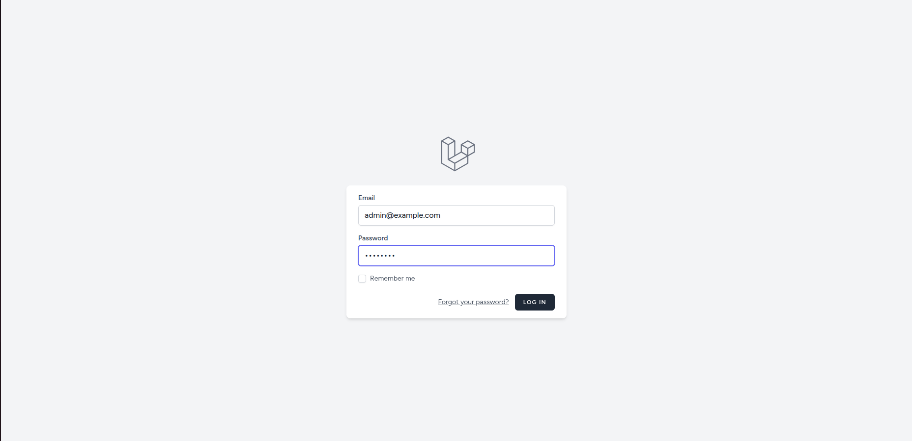
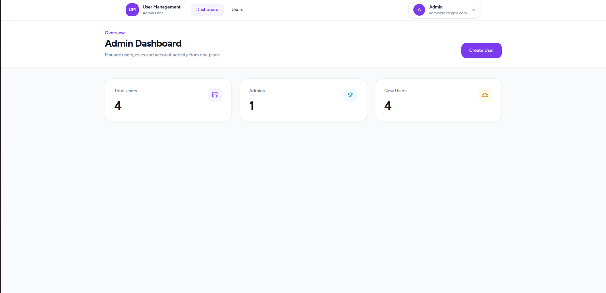
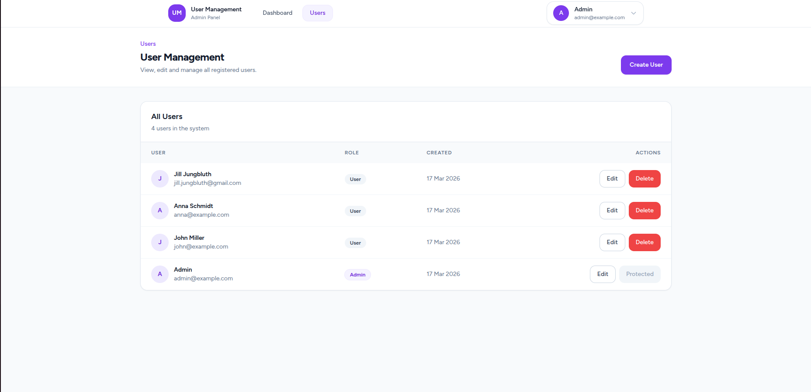
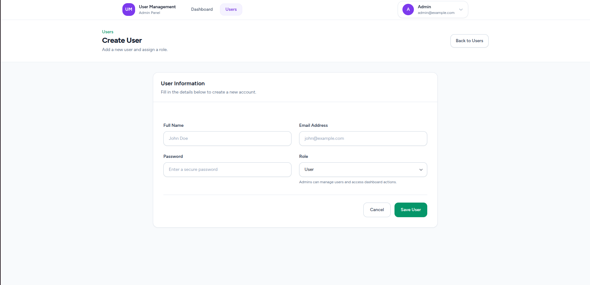

## Laravel User Management System

A simple admin dashboard built with Laravel, featuring authentication, role-based access control, and CRUD functionality for managing users.

---

## 📸 Screenshots

### Login



### Admin Dashboard



### User Management



### Create User



---

## 🚀 Features

* Authentication with Laravel Breeze
* Role-based access control (Admin / User)
* Admin dashboard with statistics
* Full CRUD user management
* Protected routes via middleware
* Clean UI with Tailwind CSS
* Form validation
* MySQL database integration

---

## 🛠 Tech Stack

* Laravel
* PHP 8+
* Blade
* Tailwind CSS
* MySQL
* Laravel Breeze
* Eloquent ORM
* Vite

---

## 🔐 Demo Access

**Admin Account**

Email: [admin@example.com](mailto:admin@example.com)
Password: password

---

## 📂 Demo Pages

* `/login`
* `/dashboard` (User)
* `/admin` (Admin)
* `/admin/users`

---

## ⚙️ Installation

```bash
git clone https://github.com/jilljungbluth-dev/laravel-user-management-system.git
cd laravel-user-management-system
composer install
cp .env.example .env
php artisan key:generate
php artisan migrate
php artisan serve
```

---

## 🎯 Project Purpose

This project demonstrates full-stack Laravel development skills, including:

* Authentication systems
* Role-based authorization
* Admin panel architecture
* CRUD operations
* Middleware and route protection
* Clean UI design with Tailwind
* Database design and Eloquent ORM

---

## 💡 Notes

* Admin routes are protected via middleware
* Users cannot access admin pages (403 protection)
* Clean separation between admin and user dashboards

---

## 📌 Future Improvements

* Pagination & search for users
* API version (REST / Sanctum)
* Unit & feature tests
* Dark mode UI

---
